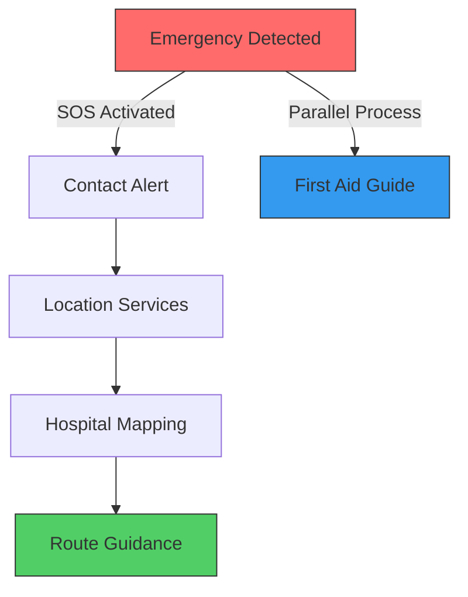
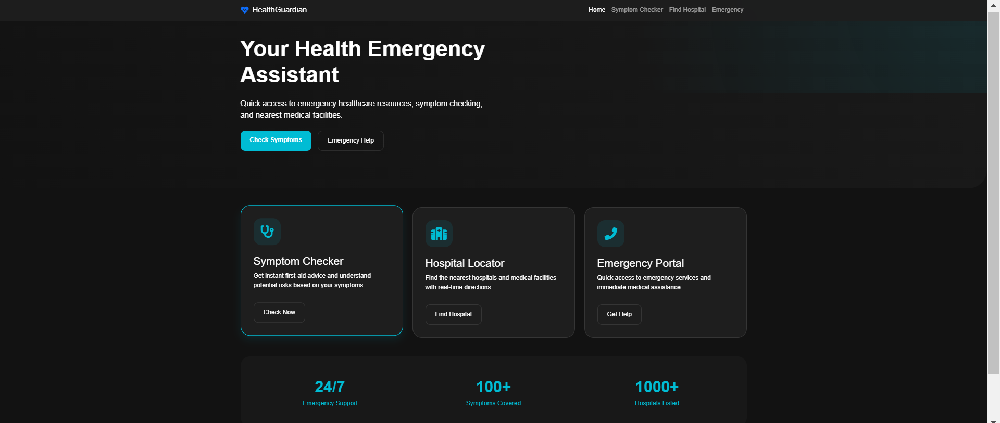
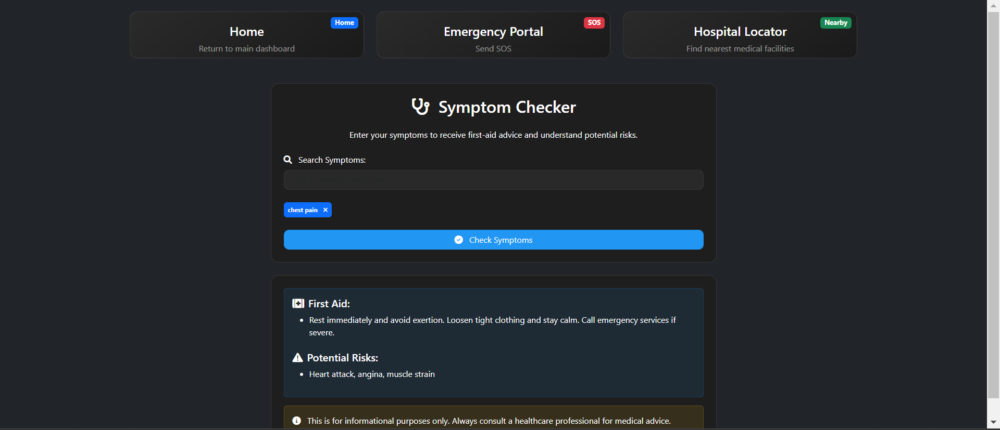
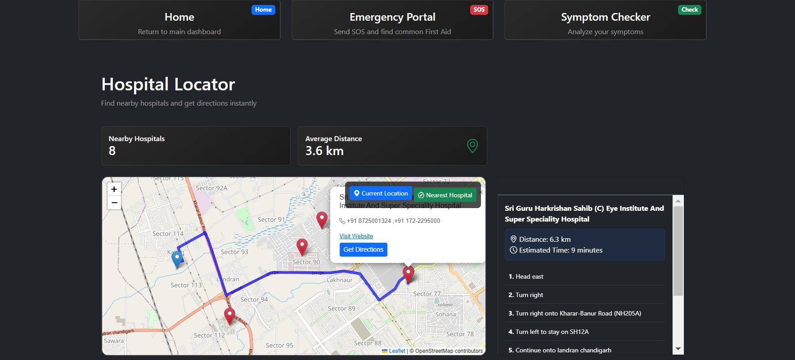
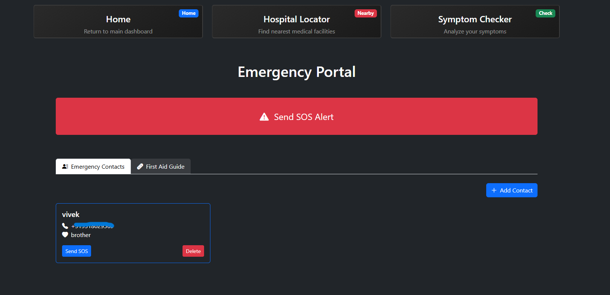
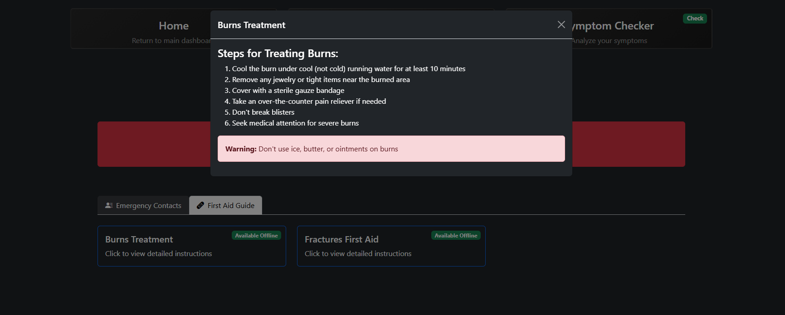

<!-- Animated Header -->
<div align="center">

# HealthGuardian 

[](https://nodejs.org/)
[](https://expressjs.com/)
[](https://getbootstrap.com/)
[](https://www.openstreetmap.org/)

_Your AI-Powered Emergency Healthcare Companion_


</div>

## 🌟 Overview

HealthGuardian is your trusted companion in medical emergencies, providing instant access to critical healthcare resources, AI-powered symptom analysis, and real-time emergency assistance. Our platform combines cutting-edge technology with medical expertise to ensure help is always within reach.

## 🚨 Emergency Features

<div align="center">

| Feature | Description | Response Time |
|---------|-------------|---------------|
| 🆘 **SOS Alert** | One-tap emergency contact notification | < 30 seconds |
| 🏥 **Hospital Finder** | Real-time nearest hospital locator | < 5 seconds |
| 🩺 **Symptom Checker** | AI-powered preliminary diagnosis | < 1 minute |
| 🚑 **Emergency Guide** | Interactive first-aid instructions | Instant |

</div>

## 🎯 Core Capabilities

### Emergency Response Flow


### Hospital Locator System
<div align="center">

| Feature | Range | Details |
|---------|-------|----------|
| 🗺️ **Radius Search** | 5km | Real-time hospital availability |
| 🚗 **Route Planning** | Dynamic | Traffic-aware pathfinding |
| 📞 **Quick Contact** | Instant | One-tap emergency dialing |
| 🏥 **Facility Info** | Detailed | Services & specializations |

</div>

## 💉 Medical Features

### Symptom Analysis
- **AI-Powered Assessment**
  - Rapid symptom evaluation
  - Risk level classification
  - Treatment recommendations
  - Emergency action plans

### First Aid Guidance
- **Interactive Instructions**
  - Step-by-step procedures
  - Visual demonstrations
  - Voice-guided assistance
  - Emergency protocols

## 📱 Application Interface

<div align="center">

| Module | Preview | Key Features |
|--------|---------|--------------|
| **Home Dashboard** |  | Quick access to emergency features |
| **Symptom Checker** |  | AI-powered health assessment |
| **Hospital Locator** |  | Real-time hospital mapping |
| **Emergency Portal** |  | One-tap SOS activation |
| **First Aid Guide** |  | Interactive medical guidance |

</div>

## 🛠️ Technology Architecture

<div align="center">

| Layer | Technologies |
|-------|--------------|
| **Frontend** |    |
| **Backend** |   |
| **APIs** |   |
| **Real-time** |  |

</div>

## 🚀 Quick Setup

1. **Clone & Install**
```bash
git clone https://github.com/yourusername/HealthGuardian.git
cd HealthGuardian
npm install
```

2. **Configure Environment**
```bash
# Create .env file with your credentials
TWILIO_ACCOUNT_SID=your_sid
TWILIO_AUTH_TOKEN=your_token
EMERGENCY_CONTACT=emergency_number
```

3. **Launch Application**
```bash
npm start
```

## 🔮 Future Enhancements

<div align="center">

| Feature | Priority | Status |
|---------|----------|---------|
| 🧬 **AI Diagnosis Enhancement** | High | Planning |
| 📱 **Mobile App Development** | High | In Progress |
| 🌐 **Multi-language Support** | Medium | Planning |
| 🤖 **Voice Assistant Integration** | Medium | Research |
| 🏥 **Hospital Partnership API** | High | Planning |

</div>

## 🤝 Contributing

We welcome healthcare professionals and developers! Here's how to contribute:

1. 🍴 Fork the repository
2. 🌿 Create your feature branch (`git checkout -b feature/AmazingFeature`)
3. 💊 Commit your changes (`git commit -m 'Add AmazingFeature'`)
4. 📤 Push to the branch (`git push origin feature/AmazingFeature`)
5. 🎯 Open a Pull Request

## 📧 Support & Contact

<div align="center">

| Channel | Details |
|---------|----------|
| 📧 **Email** | [vivek27082005@gmail.com](mailto:vivek27082005@gmail.com) |


</div>

## ⚖️ License & Compliance

This project is licensed under the MIT License - see the [LICENSE](LICENSE) file for details.

### Medical Disclaimer
The information provided by HealthGuardian is for general informational purposes only. Always seek professional medical advice for serious conditions.

---

<div align="center">

**Saving Lives Through Technology**

[⬆ Back to Repo](https://github.com/rimuru2725/HealthGuardian)

<sub>Developed with ❤️ by Vivek | Powered by AI for Emergency Care</sub>

</div>
